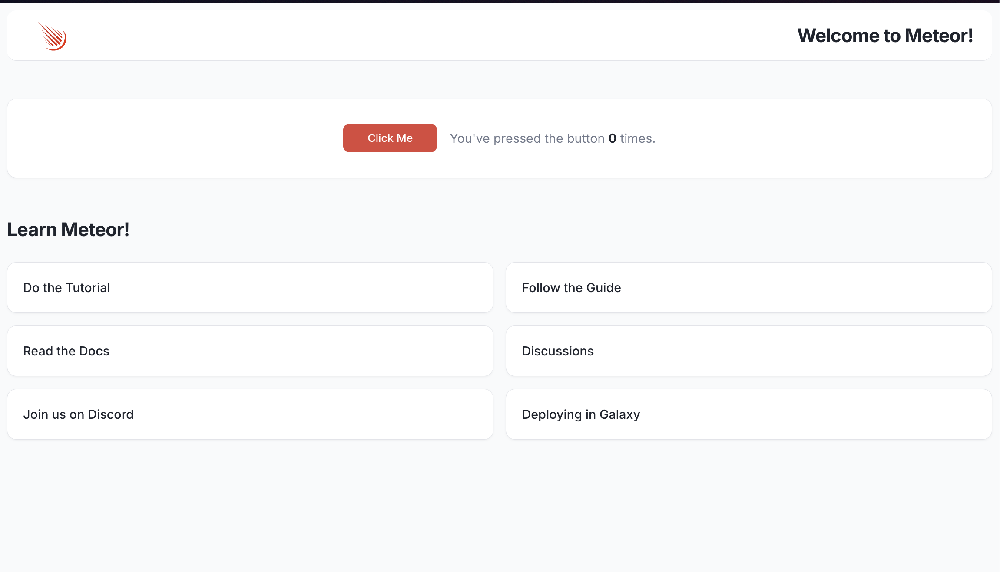

# Modern Meteor Example



## Installation
To run the app:
1. Install dependencies:

   ```bash
   meteor npm install
   ```
2. Start the Meteor development server:

   ```bash
   meteor run -o
   ```
3. This will open your default web browser to `http://localhost:3000`, where you can see the app running.


## Packages directory

- `meteor-discovery`: A package that provides a simple way to discover all the Meteor methods that are available in an application.
    It exposes a single endpoint at `/discovery` that returns a JSON object containing the names of all the Meteor methods and their corresponding parameter names.
    This also adds validation to our methods.